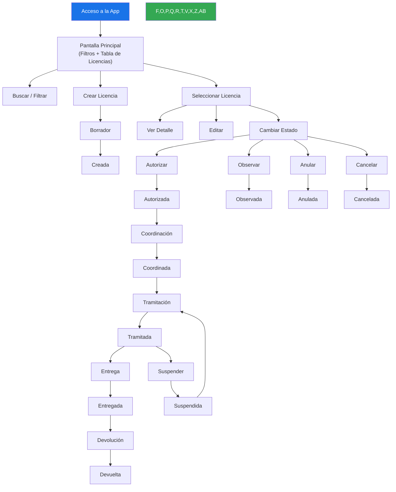
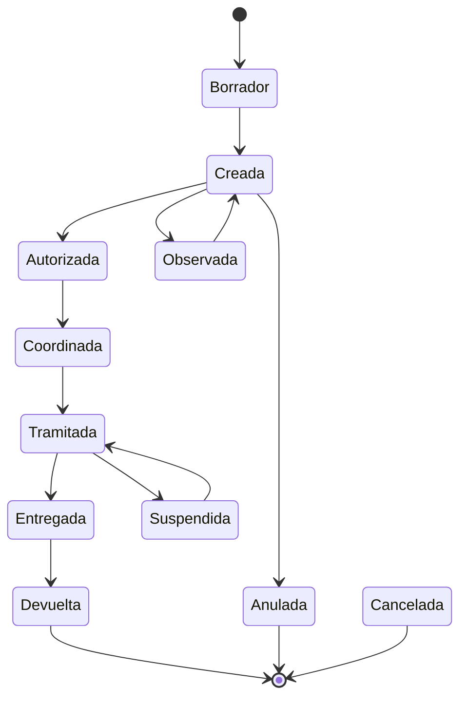

# Sistema de Turnos (Doc11)

[](https://ui5.sap.com)
[](LICENSE)
[](CONTRIBUTING.md)

Aplicación SAP Fiori para la **gestión de Licencias de Trabajo (turnos)** en operaciones de mantenimiento eléctrico de alta tensión. Desarrollada para **Transener / TRANSBA**, empresa argentina de transporte de energía.

---

## Tabla de Contenidos

- [Tecnologías](#tecnologías)
- [Pre-requisitos](#pre-requisitos)
- [Instalación y Desarrollo](#instalación-y-desarrollo)
- [Build y Despliegue](#build-y-despliegue)
- [Estructura del Proyecto](#estructura-del-proyecto)
- [Funcionalidades](#funcionalidades)
- [Flujo de la Aplicación](#flujo-de-la-aplicación)
- [Autorización](#autorización)
- [Pruebas](#pruebas)
- [Contribución](#contribución)
- [Licencia](#licencia)

---

## Tecnologías

- **Framework:** [SAPUI5](https://ui5.sap.com) 1.79.0
- **Lenguaje:** JavaScript (AMD modules)
- **Vistas:** XML (SAPUI5)
- **Datos:** OData v2 / SAP Gateway
- **Tema:** `sap_fiori_3`
- **Plataforma:** SAP Cloud Platform (Cloud Foundry)
- **Build:** UI5 Tooling ([`@ui5/cli`](https://github.com/SAP/ui5-cli))
- **Deploy:** MTA (Multi-Target Application) + HTML5 App Repository

---

## Pre-requisitos

- [Node.js](https://nodejs.org) >= 10
- npm >= 6
- [`@ui5/cli`](https://github.com/SAP/ui5-cli) (instalar global: `npm i -g @ui5/cli`)
- [`fiori`](https://www.npmjs.com/package/@sap/ux-ui5-tooling) (`npm i -g @sap/ux-ui5-tooling`)
- Acceso a servicios OData de SAP Gateway (`Z_SCP_OPERACIONES_SRV`)

---

## Instalación y Desarrollo

```bash
# Clonar el repositorio
git clone https://github.com/Transener/sistemadeturnos.git
cd sistemadeturnos

# Instalar dependencias
npm install

# Ejecutar en modo desarrollo (con mock server)
npm run start-local

# Ejecutar contra backend real
npm start

# Ejecutar sin Fiori Launchpad
npm run start-noflp
```

La aplicación se abre en `http://localhost:8080`.

---

## Build y Despliegue

### Build para producción

```bash
npm run build:cf
```

Genera el bundle preload en `dist/` y lo empaqueta como `transenersistemadeturnos.zip`.

### Deploy a Cloud Foundry

```bash
npm run build:mta   # build MTA
npm run deploy      # deploy a SAP Cloud Platform CF
```

---

## Estructura del Proyecto

```
sistemadeturnos/
├── webapp/
│   ├── index.html              # Entry point
│   ├── Component.js            # Componente SAPUI5
│   ├── manifest.json           # App descriptor
│   ├── controller/
│   │   └── Main.controller.js  # Controlador principal
│   ├── view/
│   │   └── Main.view.xml       # Vista principal
│   ├── model/                  # Modelos de datos
│   ├── services/               # Servicios OData
│   ├── utils/                  # Helpers y utilidades
│   ├── conf/                   # Configuración (roles, estados)
│   ├── fragments/              # Diálogos y fragments XML
│   ├── i18n/                   # Traducciones (español)
│   ├── css/                    # Estilos personalizados
│   ├── images/                 # Logos de la compañía
│   ├── libs/                   # Librerías de terceros
│   └── localService/           # Metadata y mock server
├── mta.yaml                    # Descriptor MTA
├── xs-app.json                 # App Router config
├── xs-security.json            # XSUAA security config
├── ui5.yaml                    # UI5 tooling config
├── ui5-local.yaml              # UI5 tooling (local dev)
└── ui5-deploy.yaml             # UI5 tooling (deploy)
```

---

## Funcionalidades

- **Gestión de Licencias de Trabajo:** creación, edición, autorización, coordinación, tramitación masiva, entrega y devolución.
- **Asignación de Turnos:** asignación de franjas horarias (desde 07:00 AM) a cuadrillas de mantenimiento.
- **Ciclo de Vida:** estados: borrador, creada, autorizada, observada, coordinada, tramitada, entregada, devuelta, suspendida, cancelada, anulada.
- **Coordinación multi-rol:** COT, COTDT, Coordinación de Mantenimiento.
- **Notificaciones por email** en cada transición de estado.
- **Adjuntos:** subida y descarga de archivos.
- **Esquemas Unifilares:** gestión de esquemas unifilares de instalaciones.
- **Reportes:** exportación a Excel y PDF.
- **Libro de Guardias:** registro de novedades.
- **Dashboard de búsqueda:** filtros por región, estación, equipo, fechas, tipo de licencia.

---

## Flujo de la Aplicación

### Ciclo de vida de una Licencia de Trabajo



### Diagrama de estados



---

## Autorización

El sistema cuenta con un modelo de autorización basado en roles definido en:

- [`webapp/conf/permisos.json`](webapp/conf/permisos.json) — permisos por rol sobre funcionalidades.
- [`webapp/conf/permisosPorEstado.json`](webapp/conf/permisosPorEstado.json) — matriz de permisos por estado de licencia.

Roles principales: `Jefe_Turno_COT`, `Operador_COT`, `Programacion_COT`, `Coordinador_Mantenimiento`, `Tramitador`, `Solicitante_Lic`, entre otros.

---

## Pruebas

```bash
# Todas las suites
npm run suite-tests

# Pruebas unitarias
npm run unit-tests

# Pruebas de integración
npm run int-tests
```

Las pruebas se ejecutan con [QUnit](https://qunitjs.com/) sobre SAPUI5.

---

## Contribución

1. Hacé un fork del repositorio.
2. Creá una rama (`git checkout -b feature/nueva-funcionalidad`).
3. Hacé los cambios y commiteá (`git commit -m 'Agrega nueva funcionalidad'`).
4. Pusheá la rama (`git push origin feature/nueva-funcionalidad`).
5. Abrí un Pull Request.

Asegurate de pasar las pruebas y mantener el estilo de código existente.

---

## Licencia

MIT © Transener S.A.
